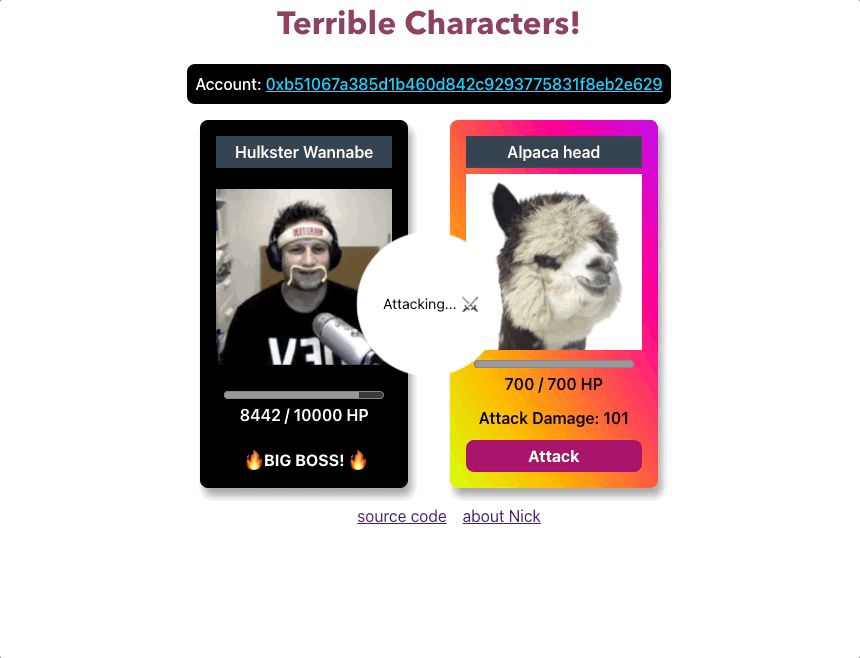

# Terrible Characters

Terrible Characters is a fun NFT based game that I built as part of a
[Buildspace](https://buildspace.so) cohort. Try it out and have some fun!

### Mint your player

<center>


</center>

### Attack the big boss

<center>



</center>

### When your player is dead

<center>


</center>

## Contributing

If you are interested in contributing to the project, first read our
[contributing guidelines](./CONTRIBUTING.md). Take a look at our
[existing issues](https://github.com/nickytonline/unofficial-edge-and-node-starter/issues),
or if you come across an issue,
[create an issue](https://github.com/nickytonline/unofficial-edge-and-node-starter/issues/new/choose).
For feature requests,
[start a discussion](https://github.com/nickytonline/unofficial-edge-and-node-starter/discussions)
first.

## Getting Started (Local Development)

1. Install the dependencies

   ```bash
   npm install
   # or
   yarn
   ```

1. Start the project

   ```bash
   npm run dev
   # or
   yarn dev
   ```

Open [http://localhost:3000](http://localhost:3000) with your browser to see the
result.

## Getting Started (Gitpod)

The project can be run in Gitpod. Navigate to
https://gitpod.io/#https://github.com/nickytonline/hello-edge-and-node. If you
wish to load it in Gitpod as an external contributor, you will need to fork the
project first, then open the fork in Gitpod, e.g.
https://gitpod.io/#https://github.com/some_user_that_forked_the_repository/hello-edge-and-node.

1. Gitpod will take a minute or two to load.
1. If this is the first time loading the project in Gitpod, it will take longer
   as all the npm packages are installing.
1. The project wil start automatically in developer mode and the app will load
   in the Gitpod preview window.

For move information on Gitpod, check out the
[Gitpod documentation](https://www.gitpod.io/docs/).

## Running tests

The project uses [jest](https://jestjs.io). For more information on jest, see
the [official documentation](https://jestjs.io/docs/getting-started).

To run tests:

```bash
npm test
# or
yarn test
```

To run tests in watch mode:

```bash
npm test:watch
# or
yarn test:watch
```

## Building out components

When building out components in the project, shared components can go in the
`components` folder. Components can then be imported using the `@components`
alias, e.g. `import { ExampleHeader } from '@components/Header';`.

### Storybook

The project uses [Storybook](https://storybook.js.org) for building our
components. For more on Storybook, see the
[official documentation](https://storybook.js.org/docs/react).

### Running Storybook

```bash
npm run storybook
# or
yarn storybook
```

### Building Storybook Static Site

```bash
npm run build-storybook
# or
yarn build-storybook
```

## Under the hood

### Basic Sample Hardhat Project

This project demonstrates a basic Hardhat use case. It comes with a sample
contract, a test for that contract, a sample script that deploys that contract,
and an example of a task implementation, which simply lists the available
accounts.

Try running some of the following tasks:

```shell
npx hardhat accounts
npx hardhat compile
npx hardhat clean
npx hardhat test
npx hardhat node
node scripts/sample-script.js
npx hardhat help
```

Unlike jest, tests for Hardhat are located in the `/test` folder and use
mocha/chai.

For more on Hardhat, see the
[official documentation](https://hardhat.org/getting-started/).

### Next.js

This is a [Next.js](https://nextjs.org/) project bootstrapped with
[`create-next-app`](https://github.com/vercel/next.js/tree/canary/packages/create-next-app).

You can start editing the page by modifying `pages/index.tsx`. The page
auto-updates as you edit the file.

[API routes](https://nextjs.org/docs/api-routes/introduction) can be accessed on
[http://localhost:3000/api/hello](http://localhost:3000/api/hello). This
endpoint can be edited in `pages/api/hello.ts`.

The `pages/api` directory is mapped to `/api/*`. Files in this directory are
treated as [API routes](https://nextjs.org/docs/api-routes/introduction) instead
of React pages.

To learn more about Next.js, take a look at the following resources:

- [Next.js Documentation](https://nextjs.org/docs) - learn about Next.js
  features and API.
- [Learn Next.js](https://nextjs.org/learn) - an interactive Next.js tutorial.

You can check out
[the Next.js GitHub repository](https://github.com/vercel/next.js/) - your
feedback and contributions are welcome!

### Ethers.js

For more on Ethers.js, check out their
[official documentation](https://docs.ethers.io/).

### Theme UI

For more on theme UI, check out their
[official documentation](https://theme-ui.com/getting-started).

## Deploy on Vercel

The easiest way to deploy your Next.js app is to use the
[Vercel Platform](https://vercel.com/new?utm_medium=default-template&filter=next.js&utm_source=create-next-app&utm_campaign=create-next-app-readme)
from the creators of Next.js.

Check out our
[Next.js deployment documentation](https://nextjs.org/docs/deployment) for more
details.
